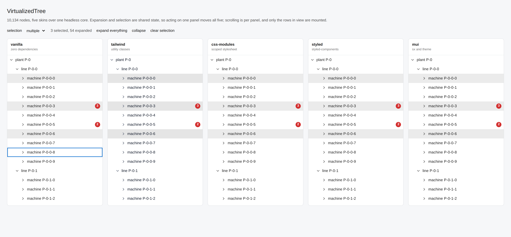
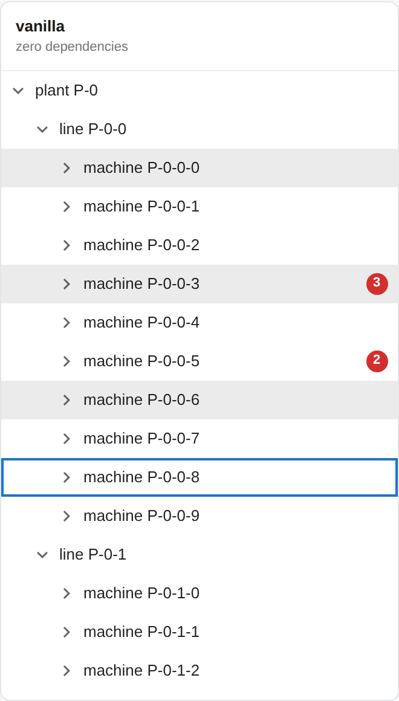

# VirtualizedTree

A generic, virtualized tree view for React. Renders only the rows currently visible in the viewport
(plus a configurable overscan), so it stays fast with large or deeply expanded trees. Supports
single/multiple selection, full keyboard navigation and proper ARIA semantics.

It has no knowledge of your data model: you tell it how to read an id, a label and children from your
own item type, and it does the rest. It also has no opinion on your styling stack.



The same tree of 10134 nodes, rendered five times with five different styling technologies over one
shared state and one shared core. Across all five panels only 110 rows exist in the DOM.



## Architecture: one core, several skins

All the behaviour lives in one place, `core/useVirtualizedTree.ts`: flattening the tree, the
virtualization window, selection semantics, keyboard navigation, focus tracking and the ARIA
attributes. It contains not a single line of styling and depends on nothing but React.

Each skin is a thin component (roughly 80 to 130 lines of markup) that spreads the props the hook
hands out and paints them with its own styling technology:

| Folder         | Styling                             | Extra dependency                           |
| -------------- | ----------------------------------- | ------------------------------------------ |
| `vanilla/`     | Inline styles + one `<style>` block | none                                       |
| `tailwind/`    | Utility classes                     | Tailwind CSS (build-time only)             |
| `css-modules/` | `*.module.css`                      | none at runtime                            |
| `styled/`      | CSS-in-JS                           | `styled-components` (or Emotion, same API) |
| `mui/`         | `sx` and the MUI theme              | `@mui/material`, `@mui/icons-material`     |

The alternative was one self-contained file per technology, with the logic copy-pasted five times.
That reads nicer for whoever copies a single file, but the virtualization math, the keyboard handling
and the selection rules are the part that can actually be wrong, and having five copies of them means
five places to fix the same bug. A skin is markup; markup is cheap to duplicate, logic is not.

**Using another UI kit?** Take `vanilla/` as the starting point and swap the elements for your kit's
primitives: Chakra, Mantine and Ant Design all map onto plain `div`s one to one. If you use
shadcn/ui, take `tailwind/` - that is already the same model, classes over unstyled elements.

## Demo

```shell
cd examples/demo
npm install
npm run dev
```

A Vite app with the five skins side by side, an industrial-plant tree of about ten thousand nodes,
selection mode switch, expand-all and per-row alert badges. `npm run screenshots` rebuilds the two
images above with Playwright and fails if the page logs a single error, so they cannot drift away from
the code.

## Requirements

- `react` >= 18 (uses `useId`)
- nothing else for `vanilla/` and `css-modules/`; see the table above for the others

## Installation

Distributed as source, not as a published npm package. Copy the `core/` folder plus the one skin
folder you want, or keep this folder somewhere and reference it as a local dependency:

```json
"dependencies": {
  "virtualized-tree": "file:../path/to/VirtualizedTree"
}
```

Import the skin you use directly, never through a root barrel: a barrel that re-exports every skin
would drag `styled-components` and MUI into a project that installed neither.

```tsx
import VirtualizedTree from "virtualized-tree/vanilla";
import { useVirtualizedTree } from "virtualized-tree";
```

## Basic usage

```tsx
import { useCallback, useState } from "react";

import VirtualizedTree from "virtualized-tree/vanilla";

type Node = { id: string; name: string; children?: Node[] };

function MyTree({ data }: { data: Node[] }) {
  const [expanded, setExpanded] = useState<string[]>([]);
  const [selected, setSelected] = useState<string[]>([]);

  const getItemId = useCallback((item: Node) => item.id, []);
  const getItemLabel = useCallback((item: Node) => item.name, []);
  const getItemChildren = useCallback((item: Node) => item.children, []);

  return (
    <div style={{ height: 500 }}>
      <VirtualizedTree
        items={data}
        getItemId={getItemId}
        getItemLabel={getItemLabel}
        getItemChildren={getItemChildren}
        itemsExpanded={expanded}
        onExpandedItemsChange={setExpanded}
        itemsSelected={selected}
        onSelectedItemsChange={setSelected}
      />
    </div>
  );
}
```

The tree fills `100%` of its parent's height: give the parent an explicit height, as above, or a flex
layout that resolves to one.

## Memoize your accessor functions

`getItemId` and `getItemChildren` are dependencies of the internal memoized flattening pass. If you
pass new inline function references on every render, the tree re-flattens its **entire** expanded
structure on every parent re-render, not just the visible rows, which defeats the point of
virtualizing it. Wrap them in `useCallback`, or define them outside the component when they close
over nothing.

`getItemLabel` and `renderItemActions` are deliberately **not** dependencies of that pass: they are
called only for the rows currently on screen, so inline lambdas there cost nothing.

## Props

Every skin takes the same props: the hook options below, plus `getItemLabel`, plus the optional
`renderItemActions`, plus its own styling escape hatch.

| Prop                    | Type                                     | Required | Default    | Description                                                              |
| ----------------------- | ---------------------------------------- | -------- | ---------- | ------------------------------------------------------------------------ |
| `items`                 | `T[]`                                    | yes      | -          | Root-level items.                                                        |
| `getItemId`             | `(item: T) => string`                    | yes      | -          | Stable unique id for an item.                                            |
| `getItemLabel`          | `(item: T) => string`                    | yes      | -          | Display label. Called only for visible rows.                             |
| `getItemChildren`       | `(item: T) => T[] \| undefined`          | no       | -          | Returns an item's children, if any.                                      |
| `itemsExpanded`         | `string[]`                               | yes      | -          | Ids of expanded items (controlled).                                      |
| `onExpandedItemsChange` | `(ids: string[]) => void`                | yes      | -          | Called when a node is expanded or collapsed.                             |
| `itemsSelected`         | `string[]`                               | yes      | -          | Ids of selected items (controlled).                                      |
| `onSelectedItemsChange` | `(ids: string[]) => void`                | yes      | -          | Called when the selection changes.                                       |
| `selectionMode`         | `"single" \| "multiple"`                 | no       | `"single"` | `"multiple"` enables shift-click ranges and ctrl/cmd-click toggle.       |
| `renderItemActions`     | `(item: T, itemId: string) => ReactNode` | no       | -          | Extra controls at the end of a row. Clicks inside do not select the row. |
| `itemHeight`            | `number`                                 | no       | `32`       | Row height in px. Must be fixed: the virtualization math depends on it.  |
| `indentWidth`           | `number`                                 | no       | `20`       | Indentation per depth level, in px.                                      |
| `overscan`              | `number`                                 | no       | `5`        | Extra rows rendered above and below the viewport.                        |
| `scrollToItemId`        | `string \| null`                         | no       | -          | Set an id to scroll it into view.                                        |
| `onScrollComplete`      | `() => void`                             | no       | -          | Called after a `scrollToItemId` scroll settles.                          |
| `scrollBehavior`        | `ScrollBehavior`                         | no       | `"smooth"` | Passed to `scrollTo`.                                                    |
| `scrollSettleMs`        | `number`                                 | no       | `300`      | Delay before `onScrollComplete` fires.                                   |
| `ariaLabel`             | `string`                                 | no       | -          | Accessible name for the tree.                                            |

Per-skin styling props:

| Skin          | Props                                                                                   |
| ------------- | --------------------------------------------------------------------------------------- |
| `vanilla`     | `className`, `style`, plus the CSS variables below                                      |
| `tailwind`    | `classNames` (`root`, `row`, `rowSelected`, `rowFocused`, `toggle`, `label`, `actions`) |
| `css-modules` | `className`, plus the CSS variables below                                               |
| `styled`      | `className`                                                                             |
| `mui`         | `sx`, `itemSx`, `labelSx`                                                               |

`vanilla` and `css-modules` read these custom properties, so you can theme them without touching the
component: `--vt-row-hover`, `--vt-row-selected`, `--vt-focus-ring`, `--vt-toggle`,
`--vt-toggle-hover`, `--vt-label`, `--vt-font-size`.

## Using the hook directly

If none of the skins fits, write your own: the hook returns behaviour and geometry, never style.

```tsx
const tree = useVirtualizedTree({ items, getItemId, getItemChildren, itemsExpanded, ... });

<div {...tree.containerProps} className='my-tree'>
  <div role='presentation' style={{ height: tree.totalHeight, position: "relative" }}>
    <div role='presentation' style={{ transform: `translateY(${tree.offsetY}px)` }}>
      {tree.rows.map((row) => (
        <div key={row.id} {...tree.getRowProps(row)} style={{ height: tree.itemHeight, paddingLeft: row.indentPx }}>
          {row.hasChildren && <div {...tree.getToggleProps(row)}>{row.isExpanded ? "-" : "+"}</div>}
          <span>{getItemLabel(row.item)}</span>
        </div>
      ))}
    </div>
  </div>
</div>
```

`containerProps` carries the ref, `role="tree"`, `tabIndex`, the aria wiring and the scroll, keyboard
and focus handlers. `getRowProps` carries the row id, `role="treeitem"`, `aria-level`,
`aria-selected`, `aria-expanded`, `data-tree-focus` and the click handler. Each `row` also exposes
`isSelected`, `isExpanded`, `hasChildren`, `depth`, `indentPx` and `isFocusVisible`.

## Accessibility and keyboard

`role="tree"` on the container, `role="treeitem"` on the rows, with `aria-level`, `aria-selected`,
`aria-expanded`, `aria-multiselectable` and `aria-activedescendant`. The activedescendant pattern is
what makes this work with virtualization: the focused row can be unmounted by scrolling without focus
being lost, because DOM focus never leaves the container.

| Key               | Action                                                                     |
| ----------------- | -------------------------------------------------------------------------- |
| `Down` / `Up`     | Move focus one row                                                         |
| `Right`           | Expand, or move to the first child if already expanded                     |
| `Left`            | Collapse, or move to the parent if already collapsed                       |
| `Home` / `End`    | First / last row                                                           |
| `Enter` / `Space` | Select the focused row (with `Shift` or `Ctrl`/`Cmd` in `"multiple"` mode) |

The focus ring is drawn only after keyboard interaction, never on a mouse click, which is why the
hook tracks pointer and focus events instead of relying on `:focus-visible`: the styled element is
the row, while the element that actually has DOM focus is the container.

## Notes and known trade-offs

- **Fixed row height.** Variable heights would need a measurement cache and an offset index; the
  whole virtualization here is `index * itemHeight`, which is what keeps it this small.
- **The `vanilla` skin emits a `<style>` element per mounted tree.** Identical rules, so the cost is
  nil, but it does show up in the DOM if you mount several trees.
- **`types/css-modules.d.ts`** is for typechecking this repo. Next.js and Vite already declare
  `*.module.css`; copying that file into a project that also declares it makes TypeScript complain
  about a duplicate declaration.
- **`selectionMode="single"` deselects** when you click the only selected row again. That was the
  original behaviour of the component this was extracted from, and it is kept on purpose.

## License

MIT, see `LICENSE`.

## Development

```shell
npm install
npm run format:check
npm run typecheck
npm test
```

15 tests, `node:test` and jsdom, no test framework. The suite has two halves:

- **Behaviour**, on the vanilla skin: only a window of rows rendered out of 10000, ARIA attributes,
  expansion order, single and multiple selection, keyboard navigation, the focus ring policy,
  `scrollToItemId` with its settle callback, and clicks on row actions not selecting the row. One
  skin is enough here, because all five share `core/`.
- **Smoke, on all five skins**: each one mounts, renders the right rows, selects, collapses, renders
  row actions, and logs zero React warnings. That last assertion is the one that catches skin-level
  mistakes, such as a styled-components prop leaking to the DOM.

The tests are bundled with esbuild before running (`scripts/test.mjs`) instead of being executed
straight from source. That is deliberate: `@mui/material` and `styled-components` ship CommonJS
without an ESM export map, so bare Node gives you the namespace object instead of the default export
and the skins fail to render for a reason no consumer will ever hit. Bundling first reproduces what
webpack, Vite and Next actually do, and it is also what lets the CSS Modules skin be tested at all.

`--test-force-exit` is passed to the runner because jsdom leaves a timer handle open that survives
`window.close()`, so the process would never exit on its own; `--test-timeout` is there to still
catch a genuine hang.

Contributions are welcome, `CONTRIBUTING.md` has the rules CI enforces. Release history is in
`CHANGELOG.md`.
